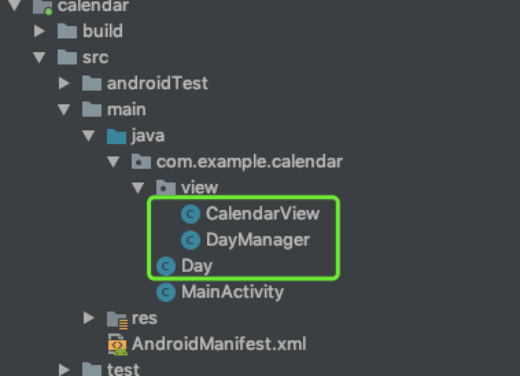
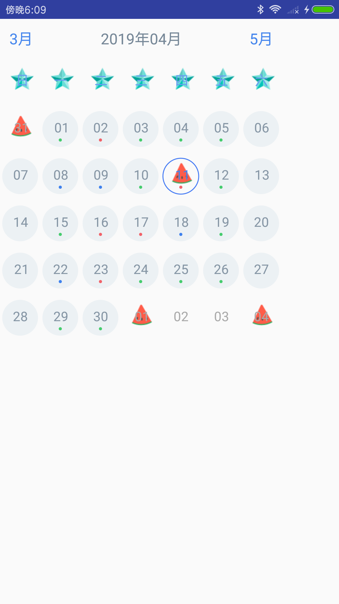
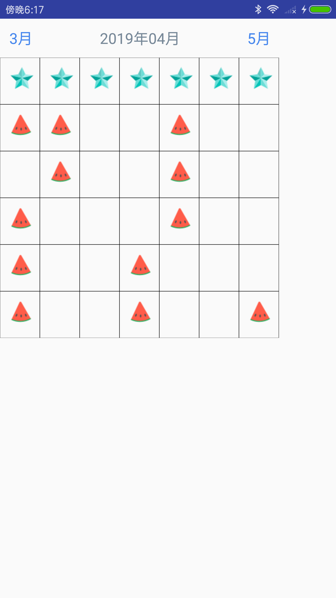
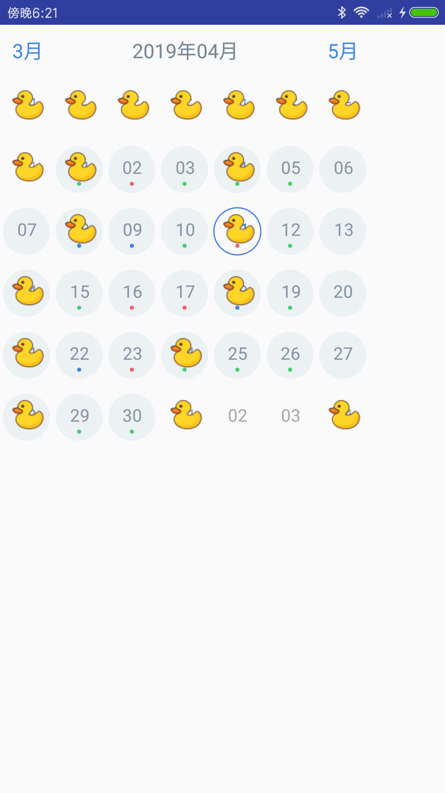

## 使用引导

#### 项目地址

[demo下载地址](https://github.com/xuanxuandaoren/CalendarView)

### 把相关类拷贝到自己项目目录线


### 在XML 布局文件中引入相关 `CalendarView`

```javascript
<?xml version="1.0" encoding="utf-8"?>
<LinearLayout xmlns:android="http://schemas.android.com/apk/res/android"
    xmlns:tools="http://schemas.android.com/tools"
    android:layout_width="300dp"
    android:layout_height="match_parent"
    android:orientation="vertical"
    tools:context="com.example.calendar.MainActivity">
    
    <com.example.calendar.view.CalendarView
        android:id="@+id/calendar"
        android:layout_width="300dp"
        android:layout_height="300dp" />
</LinearLayout>
```

至此，该日历就可以使用了

### 自定义日历界面

1、找到日历控件

```java
 import com.example.calendar.view.CalendarView;
  /**日历控件*/
 private CalendarView calendar;
 calendar = (CalendarView) findViewById(R.id.calendar);
```

2 、设置画界面回调

```java
calendar.setOnDrawDays(new CalendarView.OnDrawDays() {
            @Override
            public boolean drawDay(Day day, Canvas canvas, Context context, Paint paint) {
                
                return false;
            }

            @Override
            public void drawDayAbove(Day day, Canvas canvas, Context context, Paint paint) {

            }
        });
```

### 给星期背景加五角星

1、根据`day.dateText` 进行判断，-1为星期 ，其他的则返回当天的年-月-日

2、`public boolean drawDay(Day day, Canvas canvas, Context context, Paint paint)` 图层在原画下方

```java
            @Override
            public boolean drawDay(Day day, Canvas canvas, Context context, Paint paint) {
//               给加上五角星
                if (day.dateText.equals("-1")){
                    canvas.drawBitmap(BitmapFactory.decodeResource(getResources(),R.mipmap.wujiaoxing),20,20,paint);
                }
                return false;
            }
```


### 给日期结尾为01、04、08背景加上西瓜

```java
                @Override
            public boolean drawDay(Day day, Canvas canvas, Context context, Paint paint) {
//               给加上五角星
                if (day.dateText.equals("-1")) {
                    canvas.drawBitmap(BitmapFactory.decodeResource(getResources(), R.mipmap.wujiaoxing), 20, 20, paint);
                } else if (day.dateText.endsWith("1") || day.dateText.endsWith("4") || day.dateText.endsWith("8")) {
                    //加上西瓜
                    canvas.drawBitmap(BitmapFactory.decodeResource(getResources(), R.mipmap.xigua), 20, 20, paint);
                }


                return false;
            }
```



### 画出每天方框的大小，并使原来的消失重新画

1、`day.width` 代表日期方框的宽 `day.height` 表示方框的高

2、`public boolean drawDay()` 返回为 `true` 时，则表示原画消失

```java
      @Override
            public boolean drawDay(Day day, Canvas canvas, Context context, Paint paint) {
                paint.setStrokeWidth(1);
                paint.setStyle(Paint.Style.STROKE);
                canvas.drawRect(0,0,day.width,day.height,paint);
//               给加上五角星
                if (day.dateText.equals("-1")) {
                    canvas.drawBitmap(BitmapFactory.decodeResource(getResources(), R.mipmap.wujiaoxing), 20, 20, paint);
                } else if (day.dateText.endsWith("1") || day.dateText.endsWith("4") || day.dateText.endsWith("8")) {
                    //加上西瓜
                    canvas.drawBitmap(BitmapFactory.decodeResource(getResources(), R.mipmap.xigua), 20, 20, paint);
                }


                return true;
            }
```



### 在原画上方画鸭子

`public void drawDayAbove(Day day, Canvas canvas, Context context, Paint paint)` 图层在原画上方

```java
            public void drawDayAbove(Day day, Canvas canvas, Context context, Paint paint) {
                if (day.dateText.endsWith("1") || day.dateText.endsWith("4") || day.dateText.endsWith("8")) {
                    //加上西瓜
                    canvas.drawBitmap(BitmapFactory.decodeResource(getResources(), R.mipmap.yazi), 20, 20, paint);
                }
            }
```



### 交流

QQ交流群：194826297

微信公众号

 
